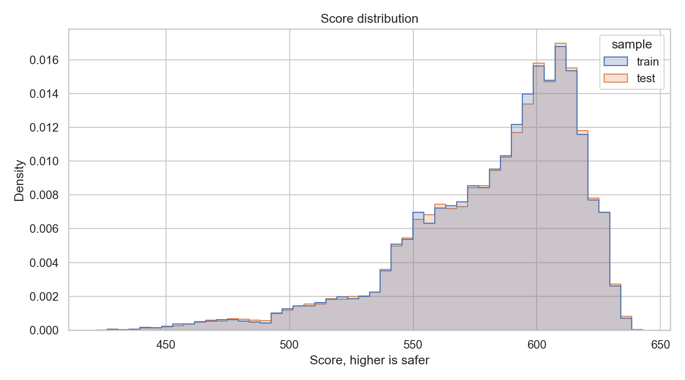
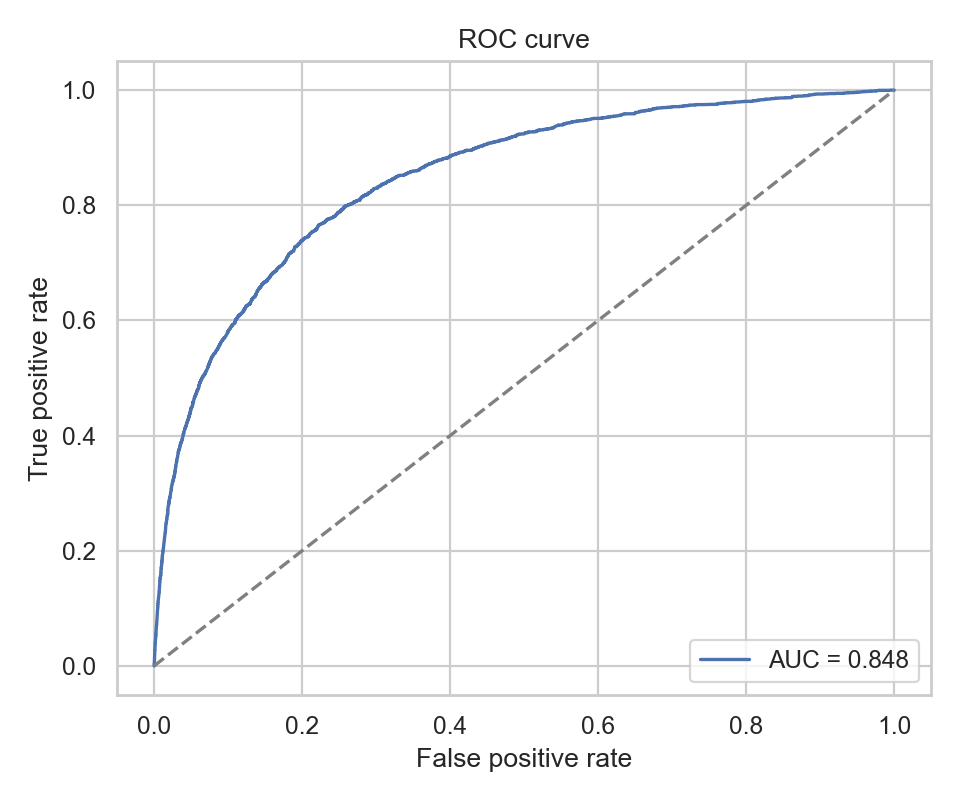
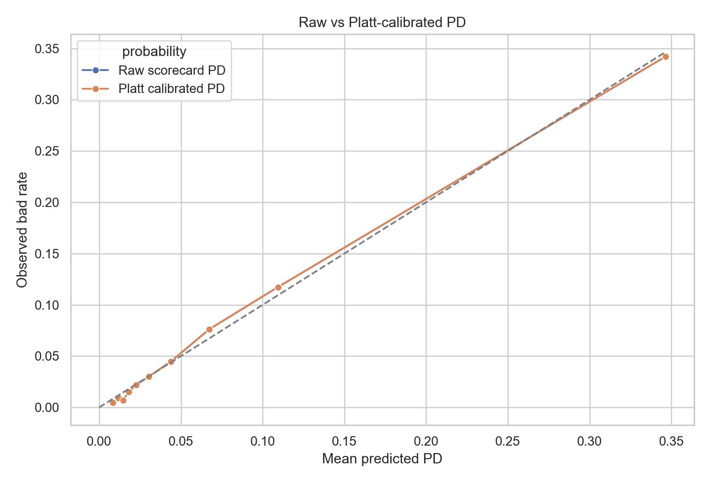
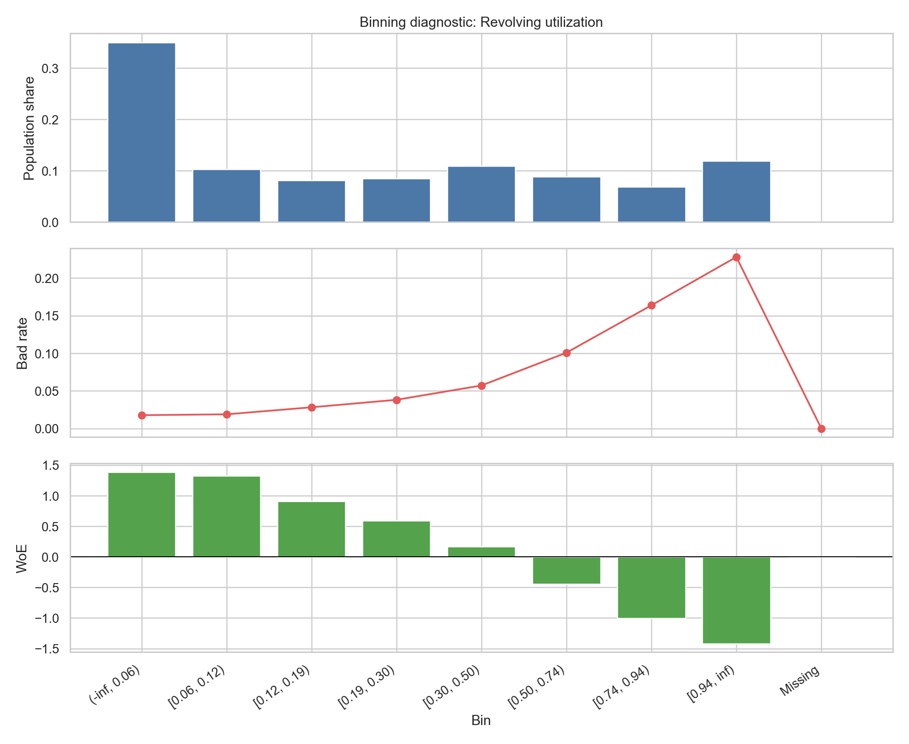
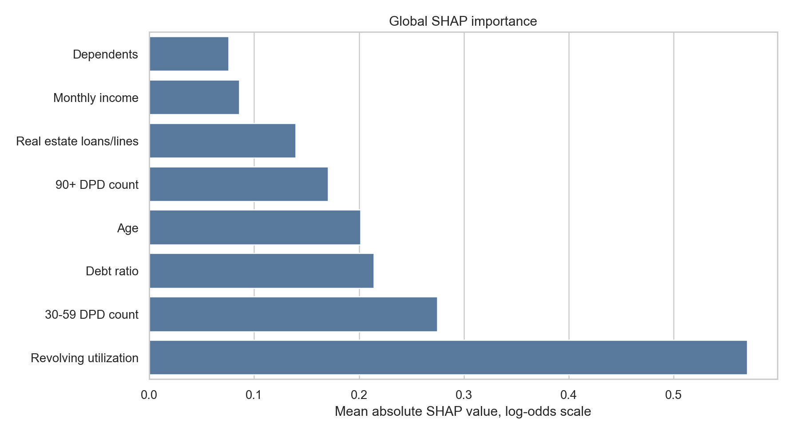

# Credit Default Prediction & Scorecard

A Python probability-of-default model and points-based credit scorecard built on the Give Me Some Credit dataset.

The project follows a bank-style credit risk workflow: data quality review, leakage-safe cleaning, train-only WoE binning, IV screening, logistic regression, scorecard scaling, validation, SHAP reason codes, and a challenger model benchmark.

## Headline Results

Champion model: logistic regression on WoE-transformed predictors.

| Metric | Held-out test value |
|--------|---------------------|
| AUC | 0.8481 |
| Gini | 0.6962 |
| KS | 0.5434 |
| Brier score | 0.0510 |

Stability note: train-vs-test score PSI is 0.0003, but because the split is a
random stratified split with no time dimension, this value is ~0 by construction
and is only a split-sanity check — not evidence of out-of-time stability. See the
Caveats section.

Bootstrap 95% confidence intervals:

| Metric | 95% CI |
|--------|--------|
| AUC | [0.8408, 0.8555] |
| Gini | [0.6817, 0.7110] |
| KS | [0.5287, 0.5593] |

Scorecard scale: 600 points at 50:1 good:bad odds, PDO = 20.



## Scorecard Artifact

The points table is saved at:

```text
reports/scorecard_points.csv
```

Each row maps one characteristic bin to scorecard points. The final scorecard uses 8 characteristics after sign, significance, and VIF checks.

## Validation

The model validates on the held-out test set only. The rank-ordering table uses eight score bands from lowest score / riskiest to highest score / safest, with monotonic bad-rate decline.



Important validation outputs:

- `reports/validation_metrics.csv`
- `reports/validation_confidence_intervals.csv`
- `reports/rank_ordering_table.csv`
- `reports/calibration_table.csv`
- `reports/calibration_comparison.csv`
- `reports/psi_summary.csv`
- `reports/validation_summary.md`
- `reports/calibration_summary.md`

## Calibration

Platt scaling is included as a probability-calibration benchmark. The raw
scorecard PD is already close to the observed central tendency, so the
calibrated and raw probability metrics are effectively unchanged.



## Binning Diagnostics

The final scorecard characteristics have bin-level diagnostic plots showing
population share, bad rate, and WoE by bin.

Example:



## Explainability

SHAP values are calculated for the linear scorecard model on the log-odds scale. Positive SHAP values raise predicted default risk; negative values lower it.



Outputs:

- `reports/shap_global_importance.csv`
- `reports/reason_codes_examples.csv`
- `reports/explainability_summary.md`
- `docs/regulatory_context.md`

## Challenger Model

An XGBoost challenger was trained on the cleaned raw predictors for benchmarking.

| Model | AUC | Gini | KS |
|-------|-----|------|----|
| Logistic scorecard | 0.8481 | 0.6962 | 0.5434 |
| XGBoost challenger | 0.8667 | 0.7335 | 0.5752 |

The challenger performs better on raw discrimination, but the logistic scorecard remains the champion because it is transparent, directly convertible into points, easier to validate, and easier to explain in a regulated credit-risk setting.

## Dataset

Primary dataset: Give Me Some Credit.

The reproducible source used here is OpenML dataset `46929`, which cites the original Kaggle competition. The fetch script downloads OpenML's ARFF file, verifies its MD5 checksum, and writes a normalized Kaggle-style CSV:

```text
data/raw/cs-training.csv
```

The target is `SeriousDlqin2yrs`:

- `1`: bad account / serious delinquency within two years
- `0`: good account / no serious delinquency within two years

Raw and processed data are git-ignored.

## How To Run

Create and activate a virtual environment:

```bash
python -m venv .venv
```

Windows PowerShell:

```powershell
.\.venv\Scripts\Activate.ps1
pip install -r requirements.txt
```

This repository was initialized with Python 3.12.13.

Run the full pipeline with one command:

```bash
python -m src.run_pipeline
```

Equivalent step-by-step commands:

```bash
python -m src.fetch_data
python -m src.eda
python -m src.data_prep
python -m src.binning
python -m src.model
python -m src.scorecard
python -m src.validation
python -m src.calibration
python -m src.diagnostics
python -m src.explainability
python -m src.challenger
python -m src.export_static_app
```

Run the test suite:

```bash
pytest
ruff check .
```

## Streamlit Demo

After running the pipeline, launch the interactive scorecard app:

```bash
streamlit run app/scorecard_app.py
```

The app lets a reviewer enter applicant characteristics and see the predicted
PD, score, risk band, reason codes, and scorecard points table.

There is also a standalone browser version generated from the scorecard
artifacts:

```text
app/scorecard_app.html
```

## Repository Map

```text
data/raw/            original dataset files, git-ignored
data/processed/      cleaned and transformed datasets, git-ignored
notebooks/           EDA notebook entry point
src/                 reproducible pipeline modules
app/                 Streamlit and standalone HTML scorecard demos
tests/               regression tests
reports/             metrics, scorecard, validation, and documentation outputs
reports/figures/     plots used in README and reports
models/              serialized models, git-ignored
docs/                data source, scope, and regulatory notes
MODEL_DOC.md         bank-style model documentation
```

## Caveats

This is a portfolio scorecard, not a production credit decisioning system. It does not include adverse-action compliance review, full fairness testing, production monitoring infrastructure, approval workflow, or independent model validation sign-off.

The dataset has no time field, so the holdout is a random stratified split rather
than an out-of-time sample. Reported PSI values are therefore ~0 by construction
and do not demonstrate stability over time. Also note that `DebtRatio` has mixed
semantics when `MonthlyIncome` is missing (~20% of rows it holds a raw dollar
amount, not a ratio); see `MODEL_DOC.md`.

The model uses `age` because it is present in the public dataset and has
predictive signal. A production model would need jurisdiction-specific legal,
compliance, and fair-lending review before using age or any protected/sensitive
characteristic directly or indirectly.

## Scale-Up Path

`src/lending_club_adapter.py` and `docs/lending_club_extension.md` provide a
scaffold for reusing the project on Lending Club data. The full second dataset
is not committed because it is large and requires separate data-source handling.
